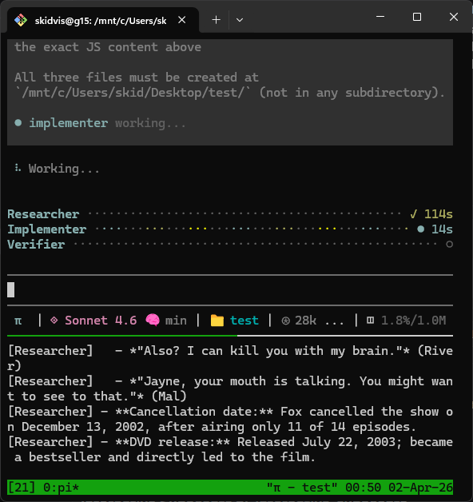

# pi-coordinator

A [pi](https://github.com/mariozechner/pi-coding-agent) extension that transforms the primary agent into a pure dispatcher/orchestrator. The coordinator is locked to one tools (`dispatch_agent`) and delegates all real work to a built-in team of three specialist subagents.



## Table of Contents

- [Based On](#based-on)
- [How It Works](#how-it-works)
- [Built-in Agent Team](#built-in-agent-team)
- [Four-Phase Workflow](#four-phase-workflow)
- [The `dispatch_agent` Tool](#the-dispatch_agent-tool)
- [Scratchpad](#scratchpad)
- [TUI Widget](#tui-widget)
- [tmux Integration](#tmux-integration)
- [Installation](#installation)
- [Requirements](#requirements)
- [Notes](#notes)

---

## Based On

`pi-coordinator` ports the Coordinator Mode pattern from Anthropic's [Claude Code](https://docs.anthropic.com/en/docs/claude-code/overview) to the `pi` coding agent.

Coordinator Mode is a multi-agent orchestration feature inside Claude Code, activated via the `CLAUDE_CODE_COORDINATOR_MODE=1` environment variable. It transforms Claude Code from a single agent into a swarm orchestrator: complex tasks are broken into structured phases and delegated to specialized subagents running in parallel.

The key aspects of that design that this project replicates:

- **Four-phase workflow:** Research, Synthesis, Implementation, Verification, enforced in strict order
- **Parallelism:** The coordinator instructs subagents to run independent tasks concurrently rather than serially
- **Shared scratchpad:** Agents communicate through a shared directory using structured file naming conventions
- **Task decomposition:** The coordinator breaks large goals into focused per-agent tasks before any code is touched
- **Context efficiency:** Worker agents share a prompt cache to reduce cost, branching only at task-specific instructions

---

## How It Works

On session start, the extension:

1. Wipes agent session files and the scratchpad from any previous session.
2. Overrides the coordinator's system prompt to enforce a strict four-phase workflow.
3. Locks the coordinator's toolset to `dispatch_agent` only.
4. Registers a live TUI widget showing agent status.
5. Opens a tmux log pane if `$TMUX` is set.

When the coordinator calls `dispatch_agent`, the extension spawns a `pi` CLI child process with `--mode json`, a restricted toolset, and a persistent session file. The subprocess streams JSON events back; the extension collects text output and returns it to the coordinator (truncated at 8,000 characters).

Each agent accumulates conversation history across dispatches within a session via `--session` and `-c` flags, so context is preserved between calls.

---

## Built-in Agent Team

| Agent | Tools | Role |
|---|---|---|
| `researcher` | `read, write, grep, find, ls` | Investigates the codebase; writes findings to the scratchpad. Never modifies source files. |
| `implementer` | `read, write, edit, bash` | Writes and edits code from a coordinator-supplied spec. |
| `verifier` | `read, write, grep, find, ls, bash` | Skeptical quality gate; runs tests and checks types. Never the same agent that implemented. |

No config files are needed. The team is hardcoded in the extension.

---

## Four-Phase Workflow

The injected system prompt enforces this workflow for every non-trivial task:

### Phase 1: Research

The coordinator dispatches at least two `researcher` agents in parallel, each focused on a distinct concern (data model, API layer, test suite, etc.). Each researcher writes findings to the scratchpad as `research-<topic>.md`. The coordinator waits for all researchers to return before proceeding.

### Phase 2: Synthesis

The coordinator personally reads the scratchpad files and writes an implementation spec to `spec-<topic>.md`. The spec must include every file to modify, exact change locations (function names, line numbers, code anchors), the exact code to add or replace, and any new files to create.

The phrase "based on your findings" is banned. The coordinator must quote specific paths, line numbers, and function names from the research notes to prove it has read them.

### Phase 3: Implementation

The coordinator dispatches `implementer` agents with the spec path. Two implementers must not edit the same file simultaneously. Independent file sets may be dispatched in parallel; overlapping or dependent changes must be serial.

### Phase 4: Verification

The coordinator dispatches the `verifier` (never the same agent that implemented) to run tests, check types, and read the actual changed code. The verifier writes a report to `verify-<topic>.md`. Verification means proving the code works, not confirming it exists.

---

## The `dispatch_agent` Tool

The coordinator's primary tool. Parameters:

| Parameter | Type | Description |
|---|---|---|
| `agent` | string | Agent name, case-insensitive (e.g. `"researcher"`, `"implementer"`, `"verifier"`) |
| `task` | string | Full task description for the agent |

Each dispatch spawns a `pi` subprocess. On Windows, the binary is invoked as `pi.cmd`. Output longer than 8,000 characters is truncated. The coordinator is notified via TUI on completion or error.

---

## Scratchpad

Located at `.pi/scratchpad/` relative to the working directory. Wiped and recreated at the start of each session. All agents can read and write here freely.

A `README.md` inside the scratchpad defines naming conventions:

| Filename pattern | Purpose |
|---|---|
| `research-<topic>.md` | Researcher findings |
| `spec-<topic>.md` | Coordinator-written implementation specs |
| `verify-<topic>.md` | Verifier reports |
| `notes-<anything>.md` | General session notes |

---

## TUI Widget

A live agent-team widget is rendered in the pi TUI. For each agent it shows:

- Name, status icon, and elapsed time
- Animated dot leader when the agent is running (`○` idle, `●` running, `✓` done, `✗` error)


---

## tmux Integration

If the `$TMUX` environment variable is set, the extension opens a new split pane on session start and tails a live log of agent activity (tool calls, completions, errors).

---

## Installation

> **Security:** pi packages run with full system access. Review the [source](https://github.com/skidvis/pi-coordinator) before installing.

**Global:**

```bash
pi install npm:pi-coordinator
```

**Project-local** (writes to `.pi/settings.json`):

```bash
pi install -l npm:pi-coordinator
```

**Ephemeral** (current session only):

```bash
pi -e npm:pi-coordinator
```

**From source:**

```bash
# Global
pi install git:github.com/skidvis/pi-coordinator

# Project-local
pi install -l git:github.com/skidvis/pi-coordinator

# Ephemeral
pi -e git:github.com/skidvis/pi-coordinator
```

No build step is needed. pi compiles TypeScript automatically at install time.

---

## Requirements

- [pi coding agent](https://github.com/mariozechner/pi-coding-agent) installed and on `PATH`

---

## Notes

**Model inheritance:** Subagents inherit the coordinator's active model. If no model is set, they fall back to `openrouter/google/gemini-3-flash-preview`.

**Session continuity:** Each agent accumulates conversation history across dispatches within a session. History is stored in `.pi/agent-sessions/<name>.json`.

**Session reset:** Agent session files and the scratchpad are wiped at the start of each new coordinator session, so every session starts clean.

**Windows support:** The `pi` binary is invoked as `pi.cmd` on Windows.

---

## License

MIT
